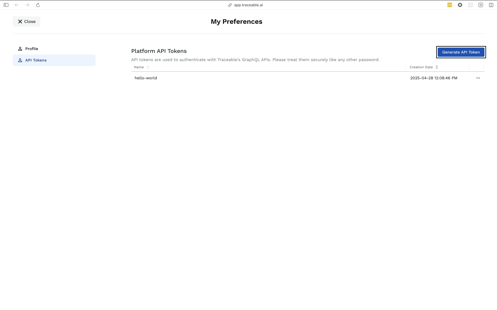
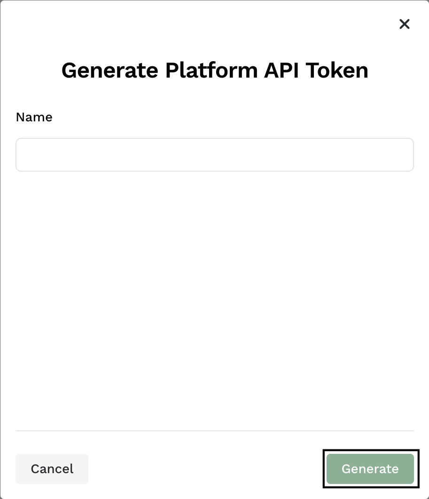
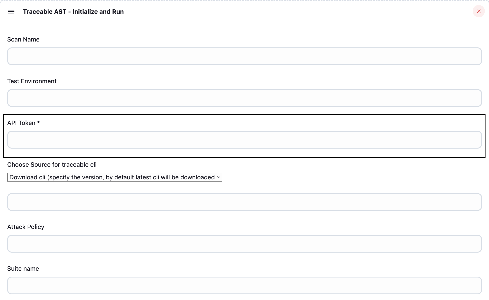
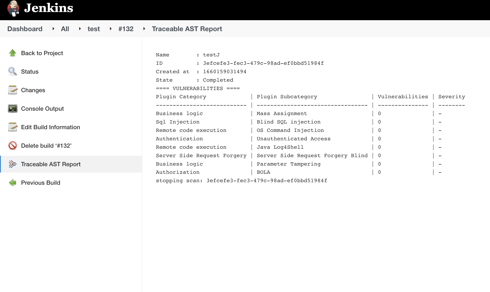

# Traceable API Security Testing Plugin

# Introduction

In the world full of microservices, there are cosmic number of APIs that a single organization exposes for internal and external use. But with the advantage of APIs making microservices architecture possible, there also comes the downside of data abuse, exposure and security. More the APIs exposed, an organization becomes more and more vulnerable to API attacks such as the <a href="https://owasp.org/www-project-top-ten/">OWASPs Top 10</a>. To solve this problem <a href="www.traceable.ai">Traceable AI</a> helps you by continuously securing your APIs, bringing you deep visibility, real-time protection, and threat analytics. Traceable AI combines distributed tracing and advanced context-based behavioral analytics to deliver modern API security to your cloud-native and API-based applications.

> **Supported Platforms:** This plugin currently supports only macOS and Linux environments.

## What is AST?

<b>API Security Testing</b> helps in finding vulnerabilities in very early stages, giving developers and Product security engineers more time and context to prioritize mitigation of vulnerabilities and build the resilient systems by scanning APIs for vulnerabilities by changing the data in the existing api specifications as required to introduce vulnerabilities.

## Features
<li>Extensive security testing coverage for microservices and APIs.</li>
<li>Generate tests from - Live traffic, OpenAPI Specs or even Recorded traces.</li> 
<li>Insertion into DevSecOps with Scan initiation and Vulnerability Management.</li>
<li>Risk based prioritization using asset inventory, threat intel, predictive modeling.</li>
<li>Allow for virtual patching for exploits to shield while Dev creates the long term fix.</li>

### 1. Installation
This Jenkins plugin for AST allows to run AST scan as a job on local jenkins instance.

<ol>
<li>Navigate to "Manage Jenkins > Manage Plugins > Available".</li>
<li>Search for "Traceable AST".</li>
<li>Install the plugin.</li>
</ol>

### 2. Generate API Token

To get your API token go to [https://app.traceable.ai/preferences/api-tokens](https://app.traceable.ai/preferences/api-tokens) and login to your Traceable account.
<ol>
<li>Click on <strong>Generate API Token</strong>.</li>

<li>In the dialog-box that appears, type in the name of the token and click on the <strong>Generate</strong> button.</li>

<li>Copy the generated API token to be used in the next step.</li>

</ol>

For more detailed instructions to configure a scan and generate API tokens, see [API Token Generation Guide](https://docs.traceable.ai/docs/suites#creating-a-suite-or-quick-scan).

### 3. Add Build Step

<ol>
    <li>To add an AST scan job, create a new item in Jenkins as a Freestyle project.</li>
    <li>Add one of the <strong>Traceable AST</strong> build steps.</li>
    
    <li>Fill the configuration fields for the job.</li>
    <li>Click on Advanced button to fill additional configuration fields.</li>
    <li>Apply and Save.</li>
</ol>

> **Important:** API Token is a required field. API Token is the same generated in [Generate API Token](#2-generate-api-token).

### 4. View Traceable AST Report

> **Important:** The Traceable AST report tab will only be visible if the <strong>Traceable AST - Generate Scan Result</strong> build step is added to your Jenkins job.

<ol>
<li>Build a job, which will run a scan according to the configurations.</li>
<li>After the completion of the job, go to the Job's page.</li>
<li>the report of the scan will be available as the Traceable AST report tab.</li>
</ol>
The scan report shows the number of vulnerabilities found for each type of plugin category.

---

## Traceable AST Build Steps

Below are the four available Traceable AST build steps. You can add one or more of these to your Jenkins job as needed:

#### 1. Traceable AST - Initialize Scan
 
Initializes a new scan. Use this step if you want to set up scan parameters before running the scan in a separate step. Useful for advanced workflows where scan configuration and execution are decoupled.

#### 2. Traceable AST - Run Scan
 
Executes an AST scan using previously initialized configuration. Use this step after “Initialize Scan” if you have separated scan setup and execution.

#### 3. Traceable AST - Initialize and Run Scan
  
Combines initialization and execution into a single step. Use this for most standard use cases where you want to configure and run the scan in one go.

#### 4. Traceable AST - Generate Scan Result
> **Note:** This step will block the Jenkins job until the scan completes or times out.

Fetches and displays the results of the completed scan in Jenkins. Add this step to your job if you want the <strong>Traceable AST report</strong> tab to appear after a scan completes.  

---

## List of Available Configuration Options

<table>
<tr>
<th>Option</th>
<th>Description</th>
</tr>
<tr>
<td>Scan Name (optional)</td>
<td>The name of the scan used to identify the scan</td>
</tr>
<tr>
<td>Test Environment (optional)</td>
<td>The environment from which we should analyze the traffic and generate tests. In most of the cases this will be the environment where functional test traffic is coming</td>
</tr>
<tr>
<td>API Token (Required)</td>
<td>API Token/Scan Token is the token you get from the Traceable Testing section while generating a new scan</td>
</tr>
<tr>
<td>Traceable CLI Binary Location (optional)</td>
<td>Provide the location of the Traceble AST cli binary, else the latest version will be downloaded from Traceable Artifactory</td>
</tr>
<tr>
<td >Plugins (optional)</td>
<td>List  of comma seperated identified vulnerabilities, for which you want to test in your scan. (Refer to help in plugins field for the list of available plugins)</td>
</tr>
<tr>
<td >Include Url Regex (optional)</td>
<td>Include the URLs which matches the regular expression in the scan</td>
</tr>
<tr>
<td >Exclude Url Regex (optional)</td>
<td>Excludes the URLs matching this regular expression in the scan</td>
</tr>
<tr>
<td >Target Url (optional)</td>
<td>Specific url for which you want to run the scan</td>
</tr>
<tr>
<td >Traceable Server (optional)</td>
<td>Specify the Traceable's server you want to use for the scan</td>
</tr>
<tr>
<td>Idle Timeout (optional)</td>
<td>Continuous duration in which if no test suite is received scan is marked completed and stopped</td>
</tr>
<tr>
<td>Scan Timeout (optional)</td>
<td>Maximum time a scan is executed,scan is stopped after scan timeout</td>
</tr>
<tr>
<td>Scan Suite (optional)</td>
<td>Name of the Scan Suite to run the scan</td>
</tr>
<tr>
<td>Include All Endpoints (default asset selected)</td>
<td>All endpoints targeted during the scan</td>
</tr>
<tr>
<td>Include Endpoint Ids (commas separated)</td>
<td>Specific endpoints ids targeted during the scan</td>
</tr>
<tr>
<td>Include Endpoint Labels (commas separated)</td>
<td>Specific endpoint labels targeted during the scan</td>
</tr>
<tr>
<td>Include Service Ids (commas separated)</td>
<td>Specific service ids targeted during the scan</td>
</tr>
<tr>
<td>XAST Replay </td>
<td>Replay traffic type used during the scan </td>
</tr>
<tr>
<td>Open Api Spec Ids (commas separated)</td>
<td>List of open api spec file ids for generating traffic used during the scan </td>
</tr>
<tr>
<td>Postman Collection Ids (commas separated)</td>
<td>Postman collection file IDs for generating traffic during the scan</td>
</tr>
<tr>
<td>Postman Environment Ids (commas separated)</td>
<td>Postman environment file IDs with target URLs and traffic environments configuration used during the scan</td>
</tr>
<tr>
<td>Hook Names (optional)</td>
<td>Authentication hook to mutate request headers during scan</td>
</tr>
</table>
<h3>NOTES:</h3>
<ul>
  <li>Only one type of asset (All Endpoints, Endpoint Ids, Service Ids, Endpoint label names) can be selected  during scan </li>
  <li>Only one type of traffic (XAST Replay, Open Api Spec Ids,  Postman Collection Ids, Postman Environment Ids) scan be used during scan. By default live traffic will be selected</li>
  <li>Provide the suite name to run the suite scan</li>
</ul>

# Compiling and testing the plugin

Compile and run the plugin automated tests on Java 11 or Java 17 with:

* `mvn clean verify`

Run the plugin inside a Jenkins environment with <a href="https://jenkinsci.github.io/maven-hpi-plugin/run-mojo.html">Maven HPI Plugin</a>

* `mvn -Djetty.port=8080 hpi:run`
### Code coverage reporting

Code coverage reporting is available as a maven target.
Please improve code coverage with tests when you submit.

* `mvn -P enable-jacoco clean install jacoco:report` to report code coverage

### Code formatting

Source code and pom file formatting is maintained by the `spotless` maven plugin.
Before submitting a pull request, confirm the formatting is correct with:

* `mvn spotless:apply`
