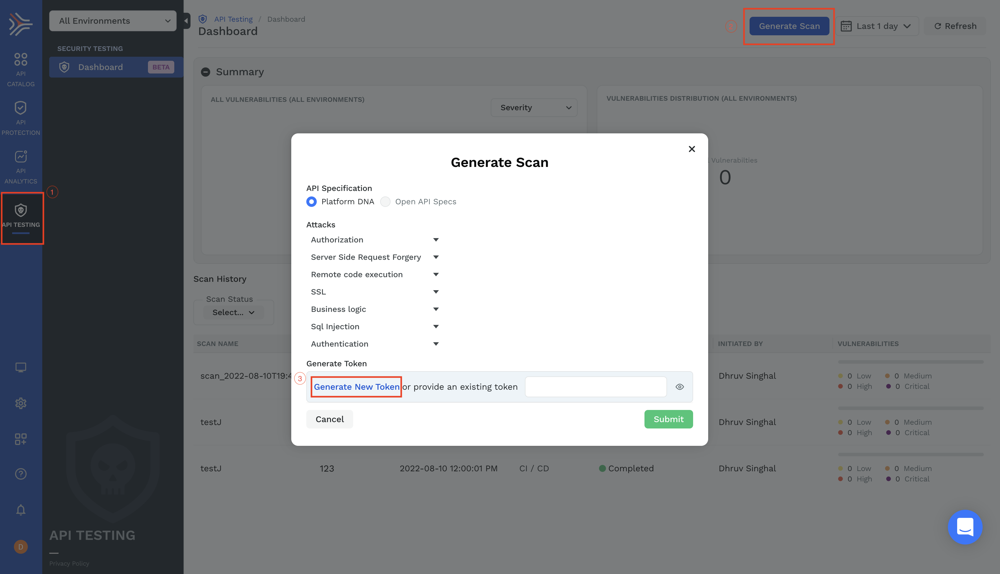
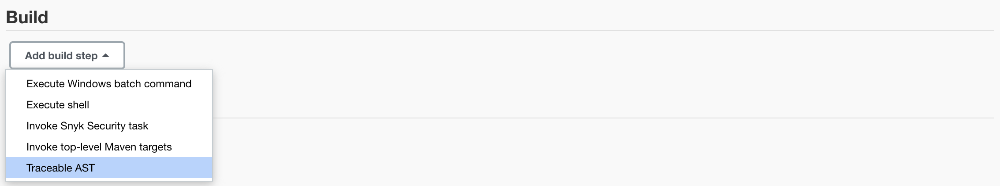
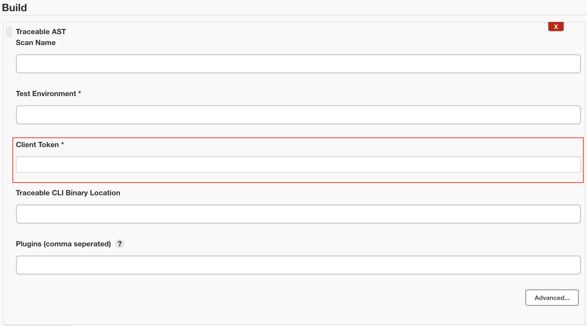
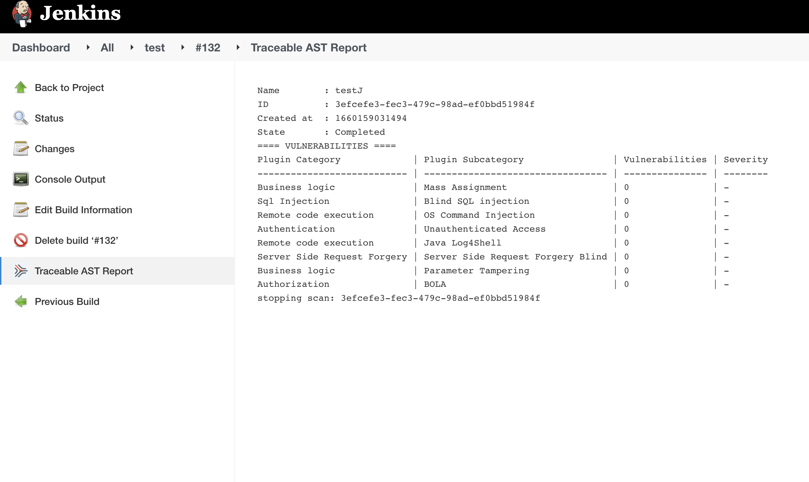

# Traceable API Security Testing Plugin
</img>
# Introduction

In the world full of microservices, there are cosmic number of APIs that a single organization exposes for internal and external use. But with the advantage of APIs making microservices architecture possible, there also comes the downside of data abuse, exposure and security. More the APIs exposed, an organization becomes more and more vulnerable to API attacks such as the <a href="https://owasp.org/www-project-top-ten/">OWASPs Top 10</a>. To solve this problem <a href="www.traceable.ai">TRACEABLE AI</a> helps you by continuously securing your APIs, bringing you deep visibility, real-time protection, and threat analytics. Traceable AI combines distributed tracing and advanced context-based behavioral analytics to deliver modern API security to your cloud-native and API-based applications.

## What is AST?

<b>API Security Testing</b> helps in finding vulnerabilities in very early stages, giving developers and Product security engineers more time and context to prioritize mitigation of vulnerabilities and build the resilient systems by scanning APIs for vulnerabilities by changing the data in the existing api specifications as required to introduce vulnerabilities.

## Features
<li>Extensive security testing coverage for microservices and APIs.</li>
<li>Generate tests from - Live traffic, OpenAPI Specs or even Recorded traces.</li> 
<li>Insertion into DevSecOps with Scan initiation and Vulnerability Management.</li>
<li>Risk based prioritization using asset inventory, threat intel, predictive modeling.</li>
<li>Allow for virtual patching for exploits to shield while Dev creates the long term fix.</li>

### 1. Installation
This Jenkins plugin for AST allows to run AST scan as a job on local jenkins instance.

<ol>
<li>Navigate to "Manage Jenkins > Manage Plugins > Available".</li>
<li>Search for "Traceable AST".</li>
<li>Install the plugin.</li>
</ol>

### 2. Get Scan Token

To get your scan token go to [app.traceable.ai](https://app.traceable.ai/) and login.
<ol>
<li>Go to the API testing tab.</li>
<li>Press the generate scan button, a dialog appears.</li>
<li>In the dialog "Generate new Token" and remember/note the scan token you generate.</li>
</ol>

### 3. Add Build Step

<ol>
    <li>To add AST scan job, create a new item in jenkins as a Freestyle project.</li>
    <li>Add Traceable AST as the build step for the job.</li>
    
    <li>Fill the configuration fields for the job.</li>
    <li>Click on Advanced button to fill additional configuration fields.</li>
    <li>Apply and Save.</li>
    
</ol>
Client Token and Traffic environment are required fields and Client Token is the same as the scan token we generated.

### 4. View Traceable AST Report

<ol>
<li>Build a job, which will run a scan according to the configurations.</li>
<li>After the completion of the job, go to the Job's page.</li>
<li>the report of the scan will be available as the Traceable AST report tab.</li>
</ol>
The scan report shows the number of vulnerabilities found for each type of plugin category.

<h6>List of Available Configuration Options:</h6>

<table>
<tr>
<th>Option</th>
<th>Description</th>
</tr>
<tr>
<td>Scan Name (optional)</td>
<td>The name of the scan used to identify the scan</td>
</tr>
<tr>
<td>Test Environment (Required)</td>
<td>The environment from which we should analyze the traffic and generate tests. In most of the cases this will be the environment where functional test traffic is coming</td>
</tr>
<tr>
<td>Client Token (Required)</td>
<td>Client Token/Scan Token is the token you get from the traceable API testing section while generating a new scan</td>
</tr>
<tr>
<td>Traceable CLI Binary Location (optional)</td>
<td>Provide the location of the Traceble AST cli binary, else the latest version will be downloaded from Traceable Artifactory</td>
</tr>
<tr>
<td >Plugins (optional)</td>
<td>List  of comma seperated identified vulnerabilities, for which you want to test in your scan. (Refer to help in plugins field for the list of available plugins)</td>
</tr>
<tr>
<td >Include Url Regex (optional)</td>
<td>Include the URLs which matches the regular expression in the scan</td>
</tr>
<tr>
<td >Exclude Url Regex (optional)</td>
<td>Excludes the URLs matching this regular expression in the scan</td>
</tr>
<tr>
<td >Target Url (optional)</td>
<td>Specific url for which you want to run the scan</td>
</tr>
<tr>
<td >Traceable Server (optional)</td>
<td>Specify the Traceable's server you want to use for the scan</td>
</tr>
<tr>
<td>Idle Timeout (optional)</td>
<td>Continuous duration in which if no test suite is received scan is marked completed and stopped</td>
</tr>
<tr>
<td>Scan Timeout (optional)</td>
<td>Maximum time a scan is executed,scan is stopped after scan timeout</td>
</tr>
</table>

# Compiling and testing the plugin

Compile and run the plugin automated tests on Java 11 or Java 17 with:

* `mvn clean verify`

Run the plugin inside a Jenkins environment with <a href="https://jenkinsci.github.io/maven-hpi-plugin/run-mojo.html">Maven HPI Plugin</a>

* `mvn -Djetty.port=8080 hpi:run`
### Code coverage reporting

Code coverage reporting is available as a maven target.
Please improve code coverage with tests when you submit.

* `mvn -P enable-jacoco clean install jacoco:report` to report code coverage

### Code formatting

Source code and pom file formatting is maintained by the `spotless` maven plugin.
Before submitting a pull request, confirm the formatting is correct with:

* `mvn spotless:apply`

